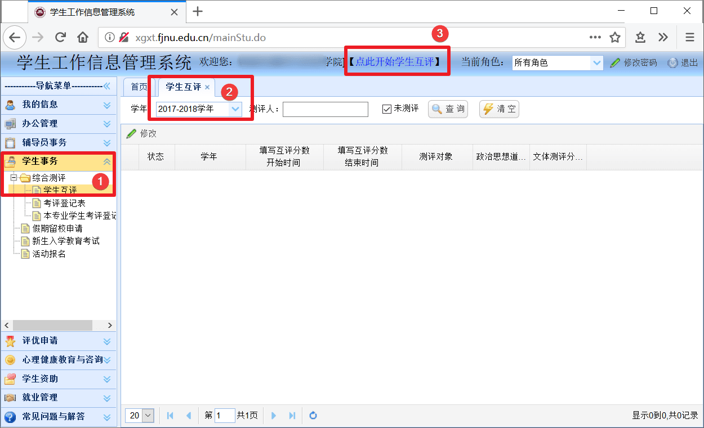
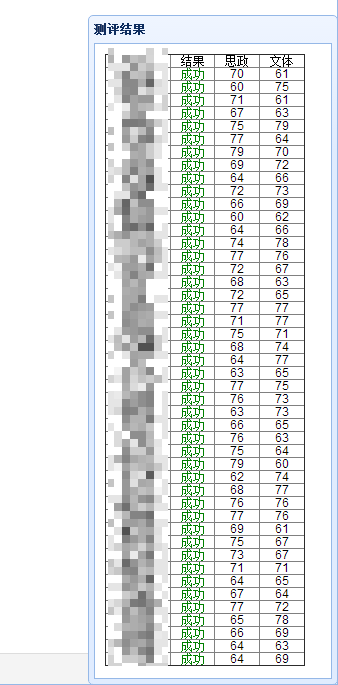

# 学生互评脚本

## 说明

福建师范大学 [学生工作信息管理系统](http://xgxt.fjnu.edu.cn) （学工系统）定期开放学生互评，此项目为互评脚本。  

## 使用方法（手动操作版）  

0）复制 [此文件](other.txt) 全部内容（代码注释部分可以不复制）  
1）登录学工系统  
2）手动选择页面：学生事务 —— 综合测评 —— 学生互评    
3）选择测评学年，例如 `2018-2019 学年`   
4）按 F12 打开浏览器控制台（Console），在控制台中粘贴上述代码，回车执行即可  

注：默认每个人都是 80 分（满分），可将代码中的 `fjnuScore` 修改成随机数。

## 使用方法（浏览器脚本版）  

0）安装任意一个浏览器脚本扩展，例如 [Tampermonkey](https://tampermonkey.net/)  
1）然后前往 [FJNU 学生互评](https://greasyfork.org/en/scripts/20333) 页面安装脚本  
2）登录学工系统  
3）手动选择页面：学生事务 —— 综合测评 —— 学生互评    
4）选择测评学年，例如 `2018-2019 学年`   
5）选择“点此开始学生互评”，然后等待完成即可  

注：默认每个人都是 80 分（满分），可将代码中的 `fjnuScore` 修改成随机数。

## 作者

 - [猎隼丶止戈](https://greasyfork.org/en/scripts/20333)  
 - 神奇海螺（零点 IT 协会）  
 
## 其他  

[Gitee 备份地址](https://gitee.com/nn200433/codes/u5azcnlbkovtjh2e79gxw) by 猎隼丶止戈  

## 协议

[GNU General Public License 3.0](https://www.gnu.org/licenses/gpl-3.0.en.html)
